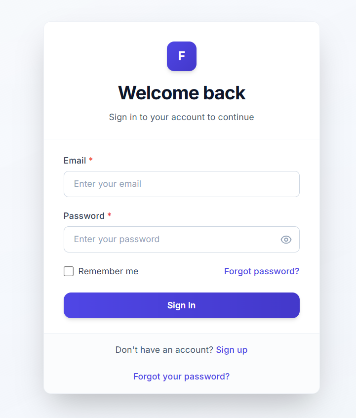

# FlowHub - Enterprise-Grade Item Management Platform

> **A showcase project demonstrating framework-level thinking, architectural decision-making, and comprehensive automation capabilities**

[]()
[]()
[]()



---

## 🎯 Project Purpose & Vision

**FlowHub** was strategically developed to serve as a **comprehensive showcase of automation engineering excellence** and **framework-level architectural thinking**. This project demonstrates not just coding skills, but the ability to make critical decisions about system design, testability, and maintainability.

### Why FlowHub Exists

As an SDET (Software Development Engineer in Test), I needed a **production-quality System Under Test (SUT)** that would allow me to demonstrate:

1. **Framework-Level Thinking**: How to architect a testable system from the ground up
2. **Decision-Making Process**: Trade-offs between complexity and maintainability
3. **Automation Strategy**: Building comprehensive test coverage across UI, API, and integration layers
4. **Real-World Complexity**: Enterprise features like RBAC, audit trails, and data isolation

**FlowHub is not just an application—it's a strategic asset that showcases how I think about systems, testing, and quality engineering.**

---

## 🏗️ Architecture & Development Approach


### AI-Assisted Development

This project was built using **AI-assisted development** to accelerate implementation while maintaining high code quality. The AI collaboration focused on:
- **Code generation** for boilerplate and repetitive patterns
- **Architecture validation** through iterative design reviews
- **Documentation generation** for comprehensive system contracts
- **Test case generation** for comprehensive coverage

**Key Insight**: The value isn't in the code itself, but in the **architectural decisions**, **testability design**, and **framework-level thinking** that went into building a system optimized for automation.

---

## ✨ Core Features


### 🔐 Multi-Role Access Control (RBAC)

FlowHub implements a **three-tier role-based access control system**:

| Role | Capabilities | Use Case |
|------|-------------|----------|
| **ADMIN** | Full system access, user management, all CRUD operations | System administrators |
| **EDITOR** | Create, edit, and manage own items; bulk operations on own data | Content creators |
| **VIEWER** | Read-only access to all items; view own activity logs | Stakeholders, auditors |

**Security Features**:
- Real-time database presence checks for session validation
- Ownership-based data isolation
- Role-based API endpoint protection
- Frontend UI masking based on permissions

### 📝 Complete CRUD Operations

- **Create**: Rich form validation, file uploads, conditional fields
- **Read**: Advanced filtering, pagination, search, sorting
- **Update**: Pre-populated forms, state-based validation rules
- **Delete**: Soft delete with confirmation modals, audit trail

### 🔑 Authentication & Security

- JWT-based authentication with refresh tokens
- Secure cookie management for cross-site scenarios
- Password reset flow with OTP verification
- Account lockout mechanisms
- Session management with real-time validation

### 📊 Activity Logging & Audit Trail

- Comprehensive activity tracking for all critical operations
- Role-based log visibility
- Chronological audit trail for compliance

### 🚀 Bulk Operations

- Mass activation/deactivation
- Asynchronous processing with progress tracking
- Role-based bulk operation permissions

---

## 🛠️ Technology Stack

### Frontend
- **React 18** with functional components and hooks
- **React Router** for navigation
- **Tailwind CSS** for styling
- **Axios** for API communication
- **Context API** for state management

### Backend
- **Node.js** with Express.js
- **MongoDB** with Mongoose ODM
- **JWT** for authentication
- **Bcrypt** for password hashing
- **Swagger/OpenAPI** for API documentation

### Testing & Automation
- **Playwright** for end-to-end UI testing
- **Pytest** for API and integration testing
- **Custom test data factories** for deterministic test environments
- **Accessibility testing** with axe-core

---

## 📁 Project Structure

```
flowhub-core/
├── backend/              # Node.js/Express API server
│   ├── src/
│   │   ├── controllers/  # Request handlers
│   │   ├── services/     # Business logic
│   │   ├── models/       # MongoDB schemas
│   │   ├── middleware/   # Auth, RBAC, error handling
│   │   └── routes/       # API endpoints
│   └── tests/            # Integration tests
├── frontend/             # React application
│   └── src/
│       ├── components/   # Reusable UI components
│       ├── pages/        # Route pages
│       ├── services/      # API clients
│       └── contexts/      # State management
└── docs/                 # Complete system documentation
    ├── flows/            # Feature documentation (PRD, FS, Architecture)
    └── automation/       # Test automation guides

testing/                  # Automation framework
├── e2e/                  # Playwright end-to-end tests
├── factories/            # Test data generation
└── examples/             # Test examples

docs/                     # System contract documentation
├── P0-ENDPOINTS.md      # Critical endpoints
├── P1-ENDPOINTS.md      # Important endpoints
├── AUTOMATION_LOCATORS.md # UI locators reference
└── SYSTEM_CONTRACT.md   # Complete API contract
```

---

## 🎓 What This Project Demonstrates


### 1. Framework-Level Thinking
- **Testability-First Design**: Every component designed with automation in mind
- **Semantic Locators**: `data-testid` attributes for reliable test automation
- **API Contract Design**: Well-defined schemas for predictable testing
- **Error Handling**: Comprehensive error responses for negative testing

### 2. Architectural Decision-Making
- **RBAC Implementation**: Centralized middleware vs. per-route checks
- **Data Isolation**: Ownership-based filtering at the service layer
- **Session Management**: Real-time validation vs. stateless tokens
- **Test Data Management**: Factory pattern for deterministic test environments

### 3. Automation Engineering Excellence
- **Multi-Layer Testing**: UI, API, and integration test coverage
- **Test Data Factories**: Reusable, maintainable test data generation
- **Accessibility Testing**: Built-in a11y validation
- **CI/CD Ready**: Structured for continuous integration

### 4. Production-Quality Code
- **Comprehensive Documentation**: PRD, Functional Specs, Architecture docs
- **Error Handling**: Graceful degradation and user-friendly messages
- **Security**: Input validation, SQL injection prevention, XSS protection
- **Performance**: Optimized queries, pagination, efficient data loading

---

## 🚀 Getting Started

### Prerequisites
- Node.js 18+
- MongoDB 6.0+
- Python 3.8+ (for test factories)

### Quick Start

1. **Clone the repository**
   ```bash
   git clone https://github.com/Dhana009/testing-box.git
   cd testing-box
   ```

2. **Set up Backend**
   ```bash
   cd flowhub-core/backend
   npm install
   cp .env.example .env
   # Configure MongoDB connection in .env
   npm start
   ```

3. **Set up Frontend**
   ```bash
   cd flowhub-core/frontend
   npm install
   cp .env.example .env
   npm run dev
   ```

4. **Run Tests**
   ```bash
   # UI Tests (Playwright)
   cd testing
   npm install
   npx playwright test
   
   # API Tests (Pytest)
   cd testing/factories
   pip install -r requirements.txt
   pytest
   ```

---

## 📚 Documentation

- **[System Contract](./docs/SYSTEM_CONTRACT.md)** - Complete API reference
- **[Priority Endpoints](./docs/P0-ENDPOINTS.md)** - Critical endpoints for testing
- **[Automation Locators](./docs/AUTOMATION_LOCATORS.md)** - UI element reference
- **[Test Data Factory Guide](./docs/TEST_DATA_FACTORY_GUIDE.md)** - Test data management

---

## 🎯 Key Differentiators

### Why FlowHub Stands Out

1. **Purpose-Built for Automation**: Not just testable, but designed from the ground up for comprehensive test coverage
2. **Enterprise Features**: RBAC, audit trails, and data isolation demonstrate real-world complexity
3. **Complete Documentation**: Every feature has PRD, Functional Spec, and Architecture documentation
4. **Framework Thinking**: Shows understanding of system design, not just implementation
5. **AI-Assisted Development**: Demonstrates ability to leverage modern tools effectively

---

## 👨‍💻 Author

**Dhanunjaya M**  
SDET (Software Development Engineer in Test)  
[LinkedIn](https://linkedin.com/in/dhanunjayam) | [GitHub](https://github.com/Dhana009)

---

## 📄 License

This project is part of a portfolio showcase. All code and documentation are available for review and demonstration purposes.

---

## 🙏 Acknowledgments

Built with AI-assisted development tools to accelerate implementation while maintaining focus on architectural decisions and framework-level thinking.

---

**Status**: ✅ Production-Ready | **Last Updated**: January 2025

*This project demonstrates not just what I can build, but how I think about systems, testing, and quality engineering.*
